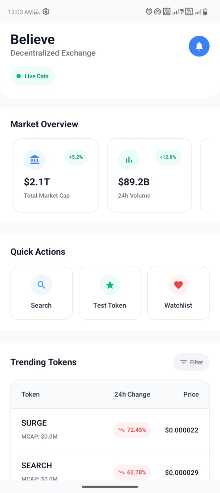
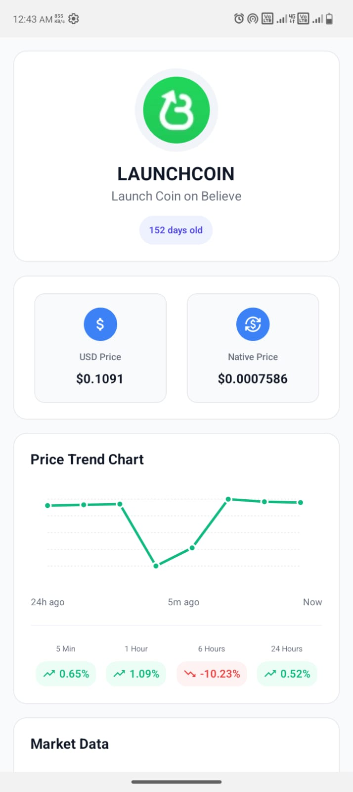
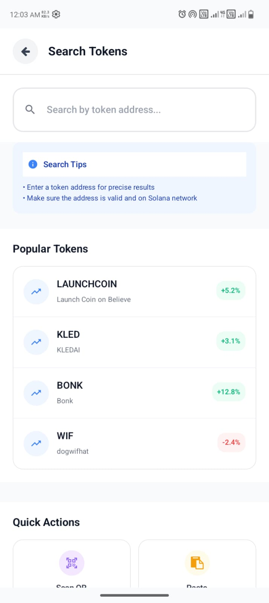

# Believe Screener Mobile Demo

A demo app for the [Believe Screener](https://believescreener.com) mobile app.

## Approach to the Solution

I used the following endpoints to fetch `chainId` and `tokenAddress`:

1. [`/token-profiles/latest/v1`](https://api.dexscreener.com/token-profiles/latest/v1)
2. [`/token-boosts/latest/v1`](https://api.dexscreener.com/token-boosts/latest/v1)
3. [`/token-boosts/top/v1`](https://api.dexscreener.com/token-boosts/top/v1)

With the fetched token addresses, I then hit:

```
https://believescreener.com/token/{tokenAddress}
```

This endpoint returns raw HTML. If the token does **not** exist on Believe Screener, the HTML response includes the text `"Token not found"`. I use this to verify whether the token exists.

After that, I hit:

```
https://api.dexscreener.com/tokens/v1/{chainId}/{tokenAddresses}
```

This returns the full token details.

> ⚠️ Note: Don't expect to see a Believe Screener token in the "Trending" list. Each endpoint returns only 30 tokens (90 total across all 3), so the chance of randomly hitting a Believe Screener token is very low.

## Running the App

**1. Clone the repo:**

```bash
git clone https://github.com/Thakur127/believe-mobile-demo.git
```

**2. Install dependencies:**

```bash
cd believe-mobile-demo
npm install
```

**3. Run the app:**

```bash
npm start
```

A QR code will appear in your terminal.

- On **Android**, install [Expo Go](https://play.google.com/store/apps/details?id=host.exp.exponent) and scan the QR code using the app.
- On **iOS**, scan it directly with your camera (not tested — I don’t have a Mac or iPhone).

## Screenshots

**Home Screen**


**Token Screen**


**Search Screen**


## Demo Video

[Demo Video](https://www.youtube.com/shorts/l12EW-b7I-U)

<iframe width="560" height="315" src="https://www.youtube.com/embed/l12EW-b7I-U" frameborder="0" allowfullscreen></iframe>
